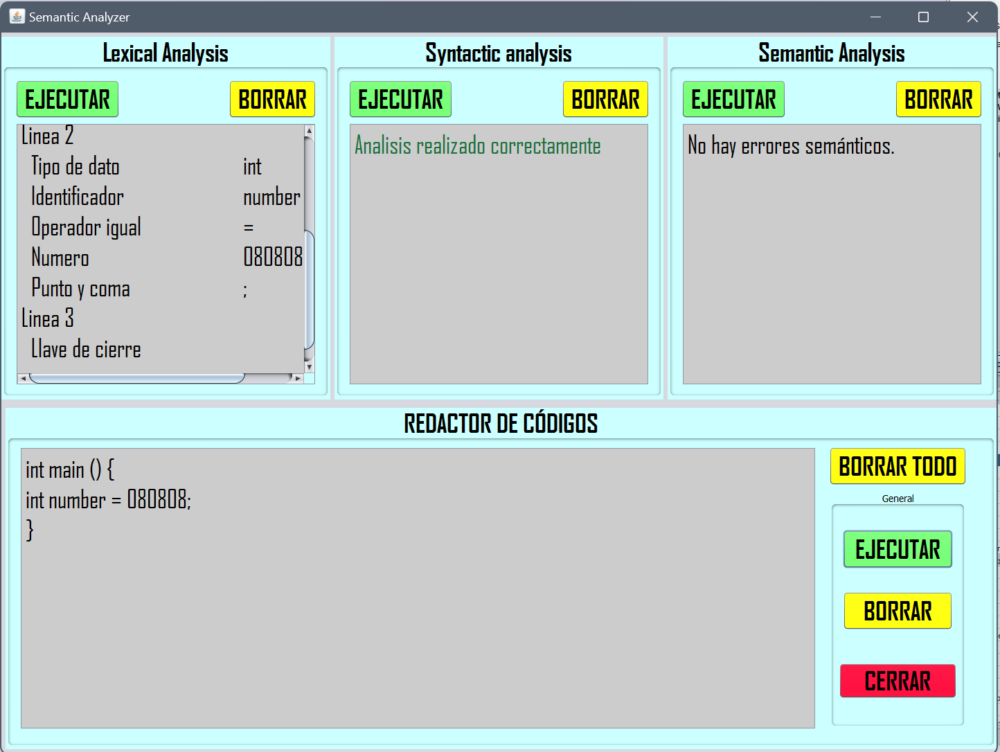

# Syntax_analyzer
1. Ejercicio. Crear un analizador Sintáctico (Cualquier tipo, LL, LR o sin usar estos métodos) en el Lenguaje de programación de su preferencia.
  * Netbeans 8.2
  * Java JDK 8 2.

2. Pruebas de código para realizar en el REDACTOR SEMANTICO
int main() {  
  int anthony = 0808;  
  for (int i = 0; i < 10; i++) {
    int numeroAleatorio = random.nextInt(101); // 101 es exclusivo, genera números entre 0 y 100
    System.out.println("Número aleatorio " + (i + 1) + ": " + numeroAleatorio);
  }
}

3. Documentar Lenguaje utilizado del analizador Léxico para realizar pruebas.
  ```java

```

4.Imagen de portada.




